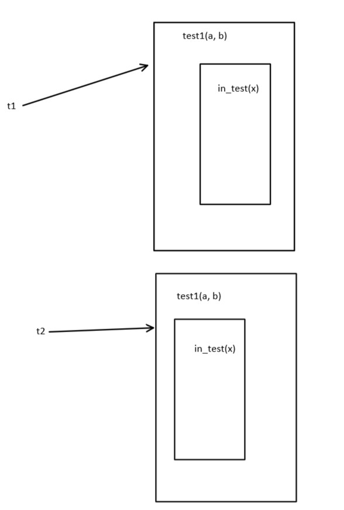

# 闭包

> 在函数中定义的函数用到了外函数的变量，则内函数和用到的外函数变量称为闭包

栗子：
```py
def test(num):
    print('-----start------')

    # 内函数，同普通函数定义方式一样
    def in_test():
        print(num)

    print('-----end------')
    # 返回内函数的引用
    return in_test


test(100)()  # 灵性调用
print('*' * 20)
t = test(100)
# t指向in_test()
t()
```

注：
* 函数名即函数的引用，类似C中的数组名是数组的引用。
* 在使用内函数时外函数不会结束。

一元方程栗子
```py
# 闭包
def test1(a, b):

    def in_test(x):
        print(f'y={a}x{x}+{b}')

    return in_test


# 非闭包
def test2(a, b, x):
    print(f'y={a}x{x}+{b}')


y1 = test1(1, 2)
y1(4)
test2(1, 2, 3)
y1(0)
test2(1, 2, 2)
# 使用闭包的话不必每次都传入a，b的值
y2 = test1(4, 9)
y2(10)
# 创建多个引用时会为它们分配不同的内存空间
```
上例内存结构图

