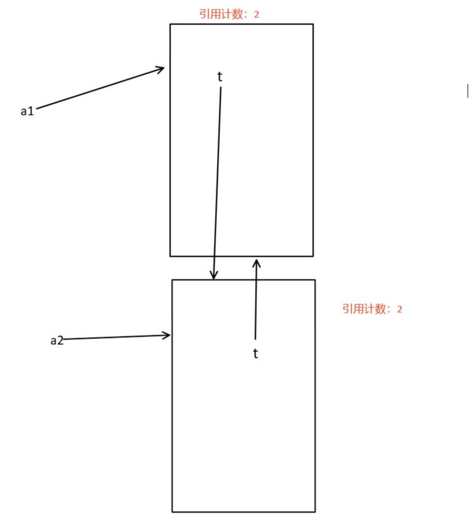
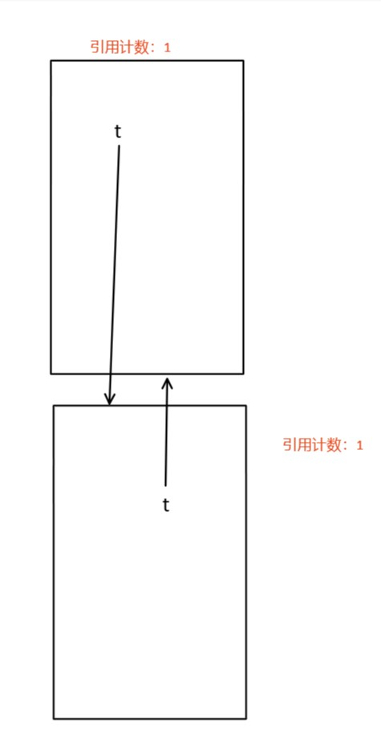

# 垃圾回收

## 小整数对象池

python解释器在运行之初会开辟一块内存空间来保存包含在[-5, 256]范围内的整数，这片内存空间称为小整数对象池，其为常驻内存，不会被回收。  
在程序中定义的多个变量，如果它们的值相等且在[-5, 256]之间，那么它们都指向小整数池中对应数的内存地址。例如：
```py
a = 100
b = 100
print(id(a), id(b))
```

## 字符串intern机制

由数字、字母、下划线组成的字符串或由单个字符组成的字符串共享内存，即 `a = 'abc', b = 'abc'` ，其中a、b所指向的内存相同，该内存只有在没有变量指向它时才会被回收。
```py
a = '?'
b = '?'
print(id(a), id(b))

a = 'aBc'
b = 'aBc'
print(id(a), id(b))
```

注：
包含特殊字符的字符串不满足此机制，但在vscode的集成开发环境中，如果在同一全局作用域中满足此机制。


## 垃圾回收机制

> 以引用计数为主、隔代回收为辅

### 引用计数

python解释器会记录每一个对象的引用数，当某对象引用数为零，即没有变量指向它，那么该对象将被回收。


### 隔代回收

当出现循环引用的情况时，引用计数的方法无法回收无用对象。
```py
class A(object):
    def __init__(self):
        print('')


a1 = A()
a2 = A()
a1.t = a2
a2.t = a1

del a1
del a2
```
内存图：




这种情况下引用计数机制无法回收无用对象。为了解决此问题而引用隔代回收机制。

具体方法：  

创建三条存放对象的数据链，将所有创建的对象放到第一条链中
1. 在满足某种条件后，python解释器将将所有对象引用计数减一，回收引用计数为零的对象。
2. 将引用计数不为零的对象放到第二条链中，等到满足条件后在将所有对象引用计数减一并删除引用计数为零的对象。
3. 将引用计数不为零的对象放到第三条链中，等到满足条件后在将所有对象引用计数减一并删除引用计数为零的对象。

三条链对象引用计数减一的频率：1 > 2 > 3

