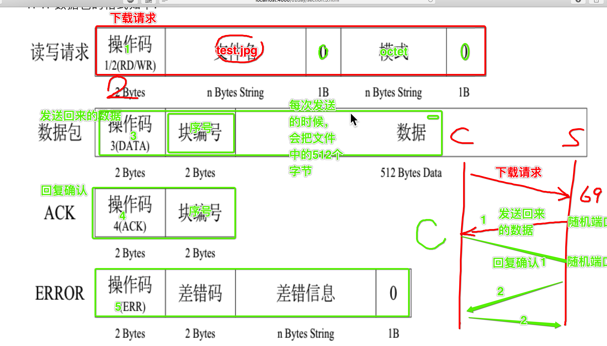

# TFTP协议

> TFTP（Trivial File Transfer Protocol,简单文件传输协议）是TCP/IP协议族中的一个用来在客户机与服务器之间进行简单文件传输的协议，提供不复杂、开销不大的文件传输服务。端口号为69。


**使用tftp协议下载上传文件过程解析**  
1. 客户端向服务器发送下载/上传文件请求。  
2. 服务器接收到请求并处理，如果文件不存在就发送error数据，如果存在就发送包含文件数据的数据包。使用新的随机端口。  
3. 客户端接收到服务器发送的数据包后会向服务器发送一个ack（确认包）以表明收到数据。  
4. 服务器会将客户端请求的文件的数据分为多个包发送给客户端，每个包最大不超过516B，小于516B的数据包表示文件传输完毕。




    操作码：1表示下载，2表示上传，3表示数据，4表示回复信息
    块编号：标识包（ack中的块编号是其要确认收到的数据包的块编号）


## 大小端模式

> 大端模式，是指数据的高字节保存在内存的低地址中，而数据的低字节保存在内存的高地址中，这样的存储模式有点儿类似于把数据当作字符串顺序处理：地址由小向大增加，而数据从高位往低位放；这和我们的阅读习惯一致。

> 小端模式，是指数据的高字节保存在内存的高地址中，而数据的低字节保存在内存的低地址中，这种存储模式将地址的高低和数据位权有效地结合起来，高地址部分权值高，低地址部分权值低。


多字节数据必须转换成大端存储再传输到网络上


## 具体实例

在向服务器发送请求时tftp协议对信息的字节占用有要求，所以要用struct模块中的方法对请求信息进行编码，struct具体用法见[官方文档](https://docs.python.org/zh-cn/3/library/struct.html?highlight=pack#struct)

```py
import struct
from socket import *
import time
import os

def main():


	#0. 获取要下载的文件名字:
	downloadFileName = input("请输入要下载的文件名:")	

	#1.创建socket
	udpSocket = socket(AF_INET, SOCK_DGRAM)


    requestFileData = struct.pack("!H%dsb5sb"%len(downloadFileName), 1, downloadFileName.encode(), 0, "octet".encode(), 0)

	#2. 发送下载文件的请求
	udpSocket.sendto(requestFileData, ("192.168.119.215", 69))

	flag = True #表示能够下载数据，即不擅长，如果是false那么就删除
	num = 0
	f = open(downloadFileName, "w")

	while True:
		#3. 接收服务发送回来的应答数据
		responseData = udpSocket.recvfrom(1024)

		# print(responseData)
		recvData, serverInfo = responseData

		opNum = struct.unpack("!H", recvData[:2])

		packetNum = struct.unpack("!H", recvData[2:4])

		print(packetNum[0])

		# print("opNum=%d"%opNum)
		# print(opNum)

		# if 如果服务器发送过来的是文件的内容的话:
		if opNum[0] == 3: #因为opNum此时是一个元组(3,)，所以需要使用下标来提取某个数据
			

			#计算出这次应该接收到的文件的序号值，应该是上一次接收到的值的基础上+1
			num = num + 1

			# 如果一个下载的文件特别大，即接收到的数据包编号超过了2个字节的大小
			# 那么会从0继续开始，所以这里需要判断，如果超过了65535 那么就改为0
			if num==65536:
				num = 0

			# 判断这次接收到的数据的包编号是否是 上一次的包编号的下一个
			# 如果是才会写入到文件中，否则不能写入（因为会重复）
			if num == packetNum[0]:
				# 把收到的数据写入到文件中
				f.write(recvData[4:])
				num = packetNum[0]

			#整理ACK的数据包
			ackData = struct.pack("!HH", 4, packetNum[0])
			udpSocket.sendto(ackData, serverInfo)

		elif opNum[0] == 5:
			print("sorry，没有这个文件....")
			flag = False

		# time.sleep(0.1)

		if len(recvData)<516:
			break

	if flag == True:
		f.close()
	else:
		os.unlink(downloadFileName)
        #如果没有要下载的文件，那么就需要把刚刚创建的文件进行删除

if __name__ == '__main__':
	main()
```
