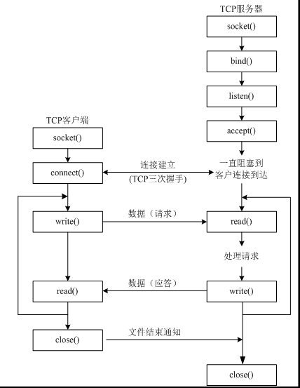

# TCP协议

> 传输控制协议（TCP，Transmission Control Protocol）是一种面向连接的、可靠的、基于字节流的传输层通信协议。


## python实现

**客户端：**  
1. 创建套接字  
2. 与服务器建立连接  

**服务器：**  
1. 创建套接字（默认为主动套接字，用于发送）  
2. 绑定端口  
3. 创建监听（将主动套接字改为被动套接字，用于接收）  
4. 等待客户端连接  
5. 与客户端连接后创建一个新的套接字用于与客户端通信  
6. 初始套接字继续等待客户端连接    
   
    注：初始的套接字用于接收用户的连接，新创建的套接字用于与客户端通信





**服务器代码：**
```py
import socket
from threading import Thread
import time


def main():
    serve_socket = socket.socket(socket.AF_INET, socket.SOCK_STREAM)

    serve_socket.bind(('', 8088))

    # 参数设置同时连接数，是正数就行，具体由操作系统决定
    serve_socket.listen(1)
    new_socket, client_info = serve_socket.accept()
    for _ in range(5):
        '''
        new_socket：新创建的用于真正与建立连接客户端通信的套接字对象
        client_info：建立连接的客户端IP和post
        程序进入等待状态直到有客户端成功连接
        '''
        new_socket, client_info = serve_socket.accept()
        thread = Thread(target=communication, args=(new_socket, client_info))
        thread.start()
        thread.join()
    serve_socket.close()


def communication(new_socket, client_info):
    recv_data = new_socket.recv(1024)
    print(f'ip:post={client_info},message={recv_data.decode()}')
    # 隔五秒再回消息
    time.sleep(5)
    message = f'当前时间：{time.asctime(time.localtime(time.time()))}，{client_info}'
    new_socket.send(message.encode())
    new_socket.close()


if __name__ == '__main__':
    main()

```

**客户端代码：**
```py
import socket
from threading import Thread
import time


def create_client(post):
    tcpSocket = socket.socket(socket.AF_INET, socket.SOCK_STREAM)
    tcpSocket.bind(('', post))
    # 创建连接
    tcpSocket.connect(('192.168.18.116', 8088))
    # 将字符串转换成字节
    tcpSocket.send(
        f'当前时间：{time.asctime(time.localtime(time.time()))}，你好！'.
        encode())

    # 参数表示最大接收字节数
    message = tcpSocket.recv(1024)
    tcpSocket.close()

    # 将字节转换成字符串
    print(message.decode())


def send():
    tcpSocket = socket.socket(socket.AF_INET, socket.SOCK_STREAM)
    tcpSocket.bind(('', 1211))

    tcpSocket.connect(('192.168.18.116', 8088))
    # 将字符串转换成字节
    tcpSocket.send(
        f'当前时间：{time.asctime(time.localtime(time.time()))}，你好！'.encode())

    # 参数表示最大接收字节数
    message = tcpSocket.recv(1024)
    tcpSocket.close()

    # 将字节转换成字符串
    print(message.decode())


if __name__ == '__main__':
    for _ in range(1200, 1206):
        Thread(target=create_client, args=(_,)).start()
        time.sleep(1)
    # send()

```

注：先运行服务器代码，运行客户端代码时报错可能是连接的太快超过了系统能承受的最大连接数
